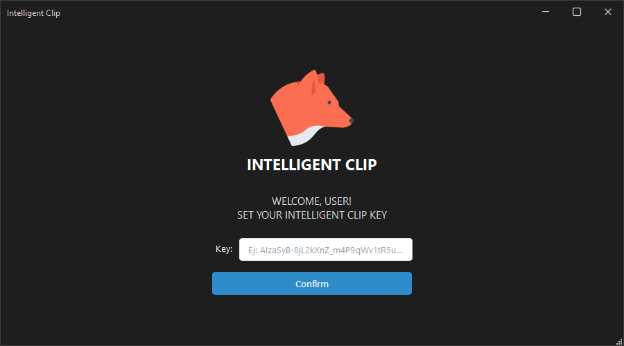
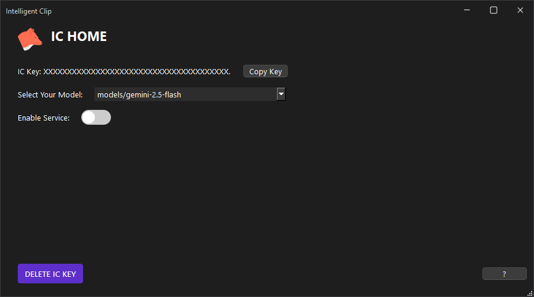

<div align="center">
  
  <br/>
  
  <br>

  [](https://www.python.org/downloads/)
  [](https://www.gnu.org/licenses/gpl-3.0)

</div>

# IC — Intelligent Clipboard

IC is a lightweight desktop application that enhances your clipboard workflow with AI-powered text processing. By listening for a configurable keyboard shortcut, IC captures your clipboard content, sends it to a Gemini language model, and replaces it with the model's response — all without interrupting your work.

## Overview

IC runs silently in the background as a frameless desktop window built on PyQt6. When activated, it intercepts the current clipboard content, processes it through the Gemini API using a predefined system prompt, and writes the result back to the clipboard — ready to paste wherever needed.

The application is designed for precision tasks that benefit from consistent, prompt-driven AI assistance: rephrasing, formatting, summarizing, or transforming text on demand.

## Features

- Hotkey-activated clipboard processing via the Gemini API
- Secure local storage of the API key using a seed-based XOR cipher
- Model selection from all Gemini models that support content generation
- Frameless, resizable window with a custom title bar
- Screen-based navigation between setup and home views
- Notification system for user feedback on key actions

## Project Structure

```
ic/
├── main.py                        # Application entry point
├── app/
│   ├── combinations.py            # Hotkey-triggered AI workflow
│   ├── controllers/
│   │   └── geminiController.py    # Gemini API wrapper
│   ├── relatives.py               # App-level configuration and cipher
│   └── relatives.json             # Runtime configuration values
├── config/
│   ├── config.py                  # Config loader using folder resolution
│   └── config.json                # Folder paths for styles, configs, etc.
├── helpers/
│   ├── folder.py                  # Filesystem folder utilities
│   ├── jsonFile.py                # JSON read/write/update utilities
│   ├── objectBuilder.py           # Dict-to-namespace converter
│   └── seedCipher.py              # Seed-based XOR encryption
├── screens/
│   ├── setup.py                   # API key input and validation screen
│   └── home.py                    # Main control screen
└── templates/
    └── defaultTemplate.py         # Frameless window layout template
```

## Requirements

- Python 3.10 or higher
- PyQt6
- QFlow (internal UI framework)
- `google-generativeai`
- `keyboard`
- `pyperclip`

Install dependencies:

```bash
pip install PyQt6 google-generativeai keyboard pyperclip
```

## Setup

1. Launch the application by running:

```bash
python main.py
```

2. On first launch, the setup screen will appear. Enter a valid Gemini API key.

3. The key is validated against the pattern defined in `relatives.json`, encrypted with the seed cipher, and stored locally.

4. Once confirmed, the application navigates to the home screen automatically.

## Usage

From the home screen:

- The stored API key is displayed in masked form and can be copied to the clipboard.
- A model selector lists all available Gemini models that support content generation.
- The listener toggle enables or disables hotkey processing.
- When the listener is active and the configured hotkey is pressed, IC reads the current clipboard, sends it to Gemini with the configured system prompt, and writes the response back to the clipboard.
- The key can be deleted at any time, returning the application to the setup screen.

## Configuration

Application behavior is driven by JSON configuration files resolved through `config/config.json`. Key runtime values — including the hotkey combination, API key pattern, prompt file path, and cipher seed — are defined in `app/relatives.json`.

The system prompt used for AI processing is loaded from the file path specified in `relatives.json` and sent automatically with every clipboard request.

## Security

The API key is encrypted at rest using a deterministic XOR cipher seeded with a fixed application string. This prevents casual inspection of stored credentials. The key is only decrypted in memory at startup and is never written in plaintext to disk.

This cipher is not cryptographically strong and is intended as obfuscation, not secure key storage. For higher-security environments, consider replacing `SeedCipher` with an OS-level keychain integration.

# Screenshots


